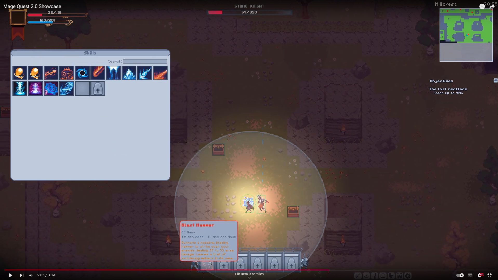
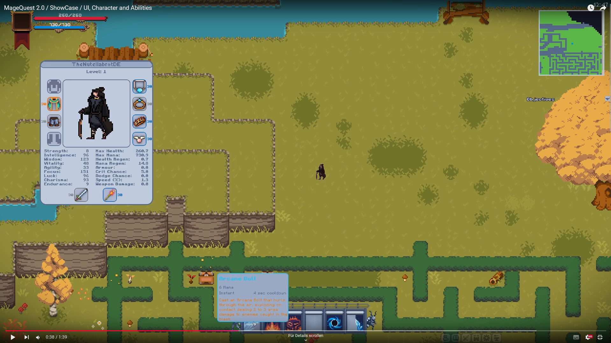

### Disclaimer: This is my old private game project made public so others can learn from it and copy interesting ideas.

It was my first big C++ and suffered many code quality issues the biggest one:

- its completely header only! (coming from Java it felt natural)

I stopped developing it at some point cause it got too cumbersome to work with.
It hurts to see it not being completed but at least it can be useful for someone.

Looking back these are its **coolest features**:

- Many UI Components (ScrollPane, TextField, ToolTip, ExpandableMenu, Inventory, TalentPanel ...)
- Custom **node-based questscript** with parser (GOTO, KILL, SPEAK)
- Fully fledged **RPG system** with attributes (40+), skills, talents, status effects and items
- **Save system** with a sqlite database
- **Multiplayer support** over steam

Apart from that there are some **resources**:
- Quest script files with fully **written quests with dialogue and decisions**
- **Monster stats** tables
- Skill names, descriptions and attributes
- Item Sets
- Status Effects

I worked on this project for about 4 months

---

## Mage Quest II

**Mage Quest II is a rewrite of my old game [Mage Quest](https://github.com/gk646/MageQuestFX) in _*C++*_ using
the [raylib](https://github.com/raysan5/raylib) library.**  
To see the base features head over to the page of the first game.

Showcasing a bossfight:  

Showcasing UI, characters and abilities:  

### New Features:

- Engine overhaul
    - Fully adjustable framerate
    - Much better performance
    - Faster saving and loading through low-level of the sqlite3 API
    - Dynamic lighting with shaders
    - Post processing effects
- Fully dynamic effects system
    - Both monsters and the player can be affected by DoT's, Buffs, Debuffs and have over 30 attributes
      -Steam integration
    - Full P2P multiplayer lobbies with up to 4 players over steam
    - full animation, projectile and enemy syncing
- New Gameplay systems
    - New item effects like: Magic Shield,
    - Ingame time and full day night cycle
    - Improved diversity of enemy pathfinding
    - Improved attacks and behaviour
- Largely improved CodeBase
  -Invented small scription language for quests / streamlined quest creation

Lines of Code: 15k
Game Assets: around 10k

### Progress: 90% of base game features ported

- Talent window (will be reimagined)